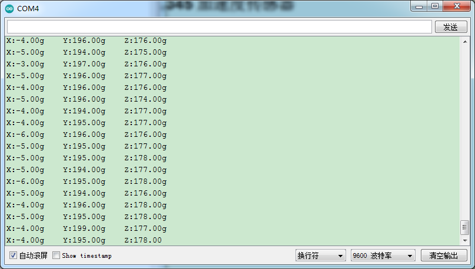

# Arduino


## 1. Arduino简介  

Arduino是一款开源电子原型平台，适合爱好者、学生和专业开发者使用。它由易于使用的硬件和软件组成，使用户能够创建互动电子项目。Arduino核心是一块可编程的微控制器，通常与各种传感器、执行器和显示器进行连接，以实现各种功能。  

Arduino的编程语言基于C/C++，用户可以利用Arduino IDE编写代码并将其上传到开发板。该平台具有丰富的社区支持和大量的教学资源，使新手能够快速上手，创造出有趣和实用的项目。  

## 2. Arduino的主要功能  

1. **开源硬件**：  
   - Arduino的硬件设计和软件都是开源的，用户可以自由修改和分享。  

2. **易于编程**：  
   - Arduino IDE提供了简单的编写、编译和上传代码的环境。内置库和示例代码可以帮助用户轻松实现各种功能。  

3. **多种硬件支持**：  
   - Arduino平台支持多种传感器和模块，适合进行各种项目设计。  

4. **丰富的社区资源**：  
   - 大量在线教程、论坛和项目分享，方便用户获取帮助和灵感。  

## 3. 接线图  

  

## 4. 测试代码  

以下是一个使用ADXL345加速度传感器的示例代码，用于读取传感器的加速度值并在串口监视器上显示。  

```cpp  
#include <Wire.h>  
#include <I2Cdev.h>  
#include <ADXL345.h> // ADXL345库  

float X = 0;  
float Y = 0;  
float Z = 0;  

ADXL345 accel;  

void setup() {  
    Serial.begin(9600); // 初始化串口通信  
    Wire.begin(); // 初始化I2C通信  
    accel.initialize(); // 初始化ADXL345传感器  
}  

void loop() {  
    // 读取加速度值  
    X = accel.getAccelerationX();  
    Y = accel.getAccelerationY();  
    Z = accel.getAccelerationZ();  

    // 打印加速度值  
    Serial.print("X: ");  
    Serial.print(X);  
    Serial.print("g Y: ");  
    Serial.print(Y);  
    Serial.print("g Z: ");  
    Serial.print(Z);  
    Serial.println("g");  

    delay(100); // 等待100毫秒  
}  
```  

## 5. 代码说明  

该代码展示了如何使用ADXL345加速度传感器获取和显示加速度值：  

1. **初始化变量**：  
   - 定义三个浮点变量X、Y和Z，用于存储加速度值。  

2. **初始化传感器**：  
   - 在`setup()`函数中，使用`accel.initialize();`来初始化ADXL345传感器。  

3. **读取加速度值**：  
   - 在`loop()`函数中，通过调用`accel.getAccelerationX()`、`accel.getAccelerationY()`和`accel.getAccelerationZ()`来获取X、Y和Z轴的加速度值。  

4. **串口输出**：  
   - 将读取到的加速度值打印到串口监视器上，用户需设置波特率为9600。  

## 6. 测试结果  

上传测试代码后，利用USB供电，并打开串口监视器，按波特率9600进行设置。串口监视器将显示传感器对应的X、Y、Z的加速度值，单位为g，如下图所示。  




