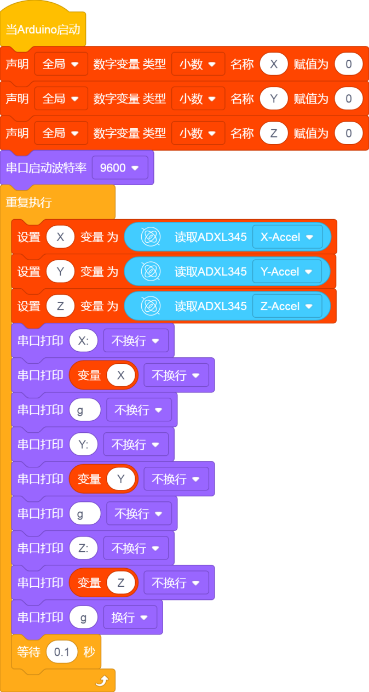
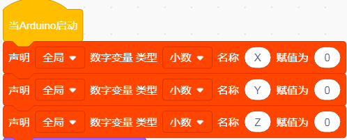
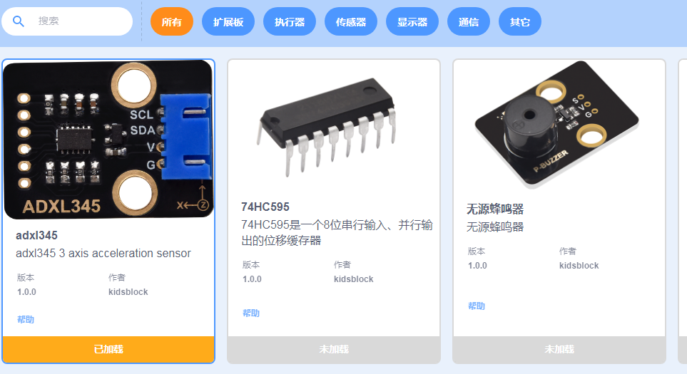
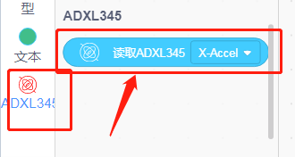
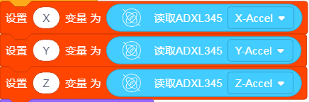
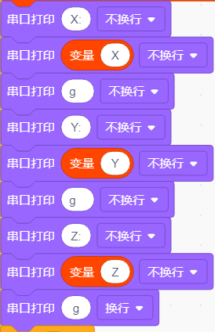
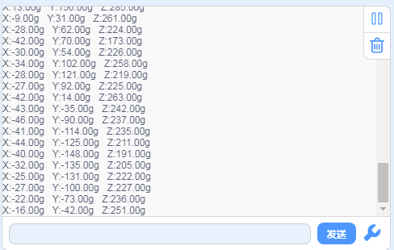

# KidsBlock

## 1. Kidsblock简介  

Kidsblock是一款面向儿童和初学者的编程工具，通过可视化编程和图形化界面，让学生们轻松学习编程和机器人技术。该工具通过模块化的编程方式，使用户能够通过拖放代码块来创建程序，从而避免繁琐的语法问题。Kidsblock支持多种硬件平台，如Arduino、Raspberry Pi等，同时兼容多种传感器和执行器，使其在教育中的应用非常广泛。  

Kidsblock的设计旨在通过互动和实践提高学生的创造力和解决问题的能力，适合用于学校教育、课外活动和个人项目。同时，该平台也提供了丰富的教学资源和示例项目，使得学习编程变得有趣和简单。  

## 2. 接线图  

  

## 3. 测试代码  

  

## 4. 代码说明  

### 4.1 变量声明  

我们先声明一个小数变量，并把变量名改为：“X”、“Y”、“Z”，赋初值为0。  

  

### 4.2 扩展ADXL345模块  

我们添加扩展ADXL345。该模块接线使用IIC接口，这里已经默认了，所以不需要我们设置。  

  

### 4.3 赋值  

加速度传感器XYZ三轴检测到的数据分别赋给变量X、Y、Z。  

  

### 4.4 串口显示  

我们在软件的串口监视器中显示XYZ三轴加速度的值。  

  

## 5. 测试结果  

上传测试代码成功，利用USB线上电后，串口监视器显示传感器对应的X、Y、Z的值，单位为g，如下图。  

