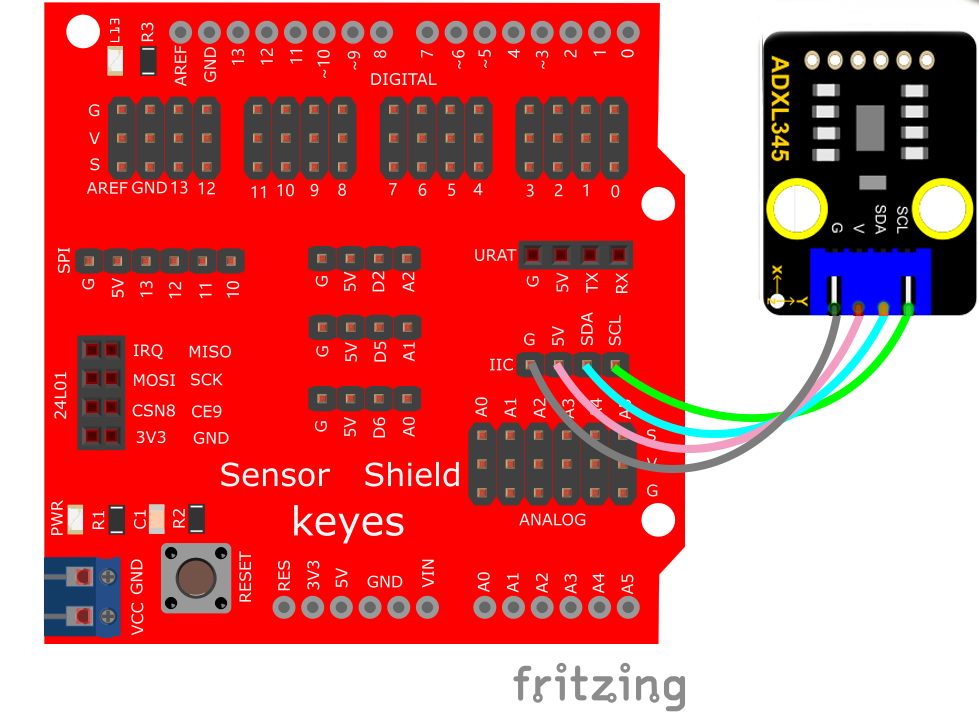
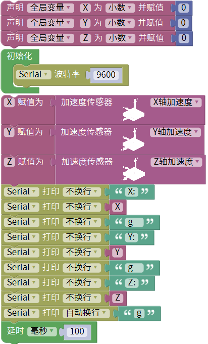
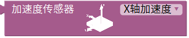
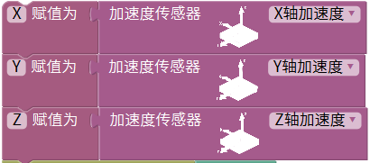
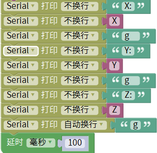
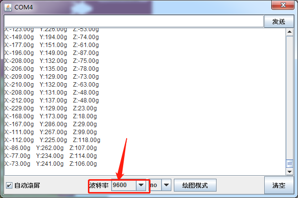

# Mixly

## 1. Mixly简介  

Mixly是一款面向初学者的可视化编程工具，它通过图形化的界面和模块化的编程方式，使得用户可以通过拖放组合来创建代码。此工具支持多种硬件平台，如Arduino、Micro:bit等，适合各种年龄段的学习者使用。Mixly的设计使得学习编程变得更为直观和有趣，尤其是在进行电子项目时，促进了用户对编程和电子技术的理解。  

Mixly提供了丰富的项目示例和教程，帮助用户一步步掌握编程技能，培养他们的创造力和逻辑思维能力。这使得Mixly成为教育工作者和家庭教育者的理想工具。  

## 2. 接线图  

  

## 3. 测试代码  

  

## 4. 代码说明  

### 4.1 变量声明  

与之前一样，我们先声明一个小数变量，并把变量名改为：“X”、“Y”、“Z”，赋初值为0。  

  

### 4.2 加速度传感器设置  

我们在库keyes sensor下的“其他模块”单元找到加速度传感器模块。该模块接线使用IIC接口，这里已经默认了，所以不需要我们设置。  

  

### 4.3 赋值  

加速度传感器XYZ三轴检测到的数据分别赋给变量X、Y、Z。  

  

### 4.4 串口显示  

我们在电脑的串口监视器中显示XYZ三轴加速度的值。  

  

## 5. 测试结果  

上传测试代码成功，利用USB线上电后，打开串口监视器，设置波特率为9600。串口监视器显示传感器对应的X、Y、Z的值，单位为g，如下图。  

